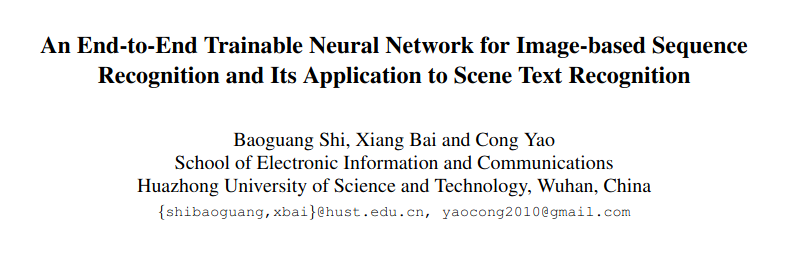
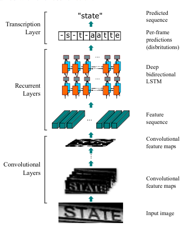
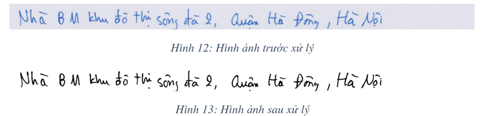
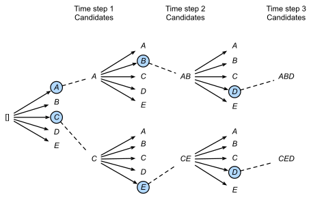
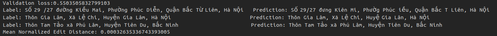
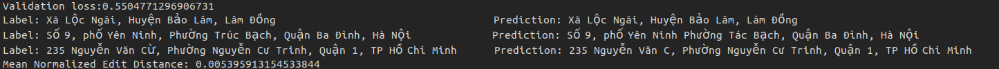
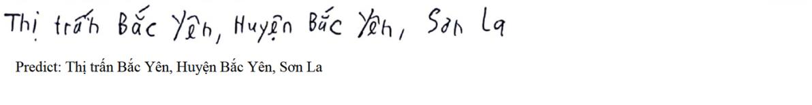
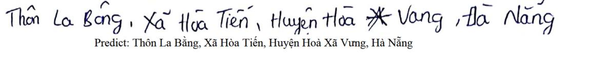

# Vietnamese_Handwriting_Recognition

An OCR model for Vietnamese Handwriting Recognition problems with CNN + LSTM implemented with PyTorch Deeplearning framework.

# Idea 
This model is based on the proposed architecture in this paper: https://arxiv.org/pdf/1507.05717.pdf
<p align="center"></p>
- I used pretrained VGG16 for CNN's backbone, and Bidirectional LSTM for recurrent layers
<p align="center"></p>

# Requirements
I highly recommend using conda virtual environment
```bash
pip install -r requirements.txt
```
# Dataset
This [dataset](https://drive.google.com/drive/folders/1Qa2YA6w6V5MaNV-qxqhsHHoYFRK5JB39) is provided by [Cinamon AI](https://cinnamon.is/vi/) for Cinamon's AI Challenge.

# Preprocessing
In this step, we have to 
- Binarized image by applying Otsu's thresholding method
- Remove noise
- Smooth boundaries by applying Contour Filter

<p align="center"></p>

# Training 
I divided training process into 2 phases:
- Phase 1: Train LSTM only: 40 epochs, freezed VGG ,lr = 1e-3
```bash
python train.py --epoch [num of epochs] --img_path [path to img directory] --label_path [path to label directory] --lr [learning rate] --batch_size [batchsize] --ft [finetune: true or false] --mode [decode mode: 'greedy' or 'beam']
```
- Phase 2: Finetune VGG16 backbone: 30 epochs, unfreezed VGG, lr = 1e-4
```bash
python finetune.py --epoch [num of epochs] --img_path [path to img directory] --label_path [path to label directory] --lr [learning rate] --batch_size [batchsize] --ft [finetune: true or false] --mode [decode mode: 'greedy' or 'beam']
```

# Decoding
I used [CTC](https://towardsdatascience.com/intuitively-understanding-connectionist-temporal-classification-3797e43a86c) as loss function. There are two strategies for decoding task, [Greedy or BeamSearch](https://d2l.ai/chapter_recurrent-modern/beam-search.html) decoder.
<p align="center"></p>

# Inference
<p align="center"></p>
<p align="center"></p>

# Result
<p align="center"></p>
<p align="center"></p>


